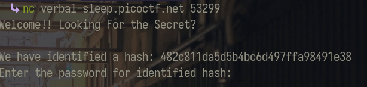
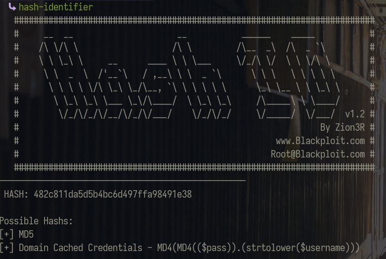
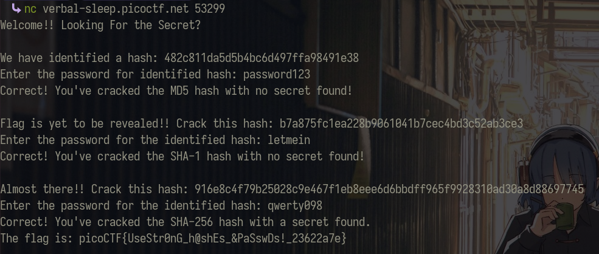

# hashcrack
This is a simple starting crypto challenge where you're provided with a hashed password.

Next step is to identify the hash.

We managed to figure out that MD5 is the hash algorithnms used. Decoding it would give us the password being `password123`

Entering in the passcode would the prompt us with 2 more hashed passwords to solve. At which point, repeat the steps above to finally get the flag.

