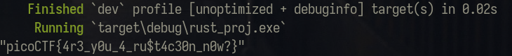
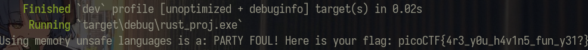
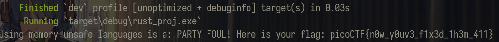

# Rust fixme 1/2/3

### Description
All 3 of the rust fixme challenges each provides you with a tar.gz zip file containing a rust project.

The point of the challenge is to simply fix whatever syntax error there are within the code and then running it with the help of something like Cargo.

## fixme 1
```rust
use xor_cryptor::XORCryptor;

fn main() {
    // Key for decryption
    let key = String::from("CSUCKS") // How do we end statements in Rust?

    // Encrypted flag values
    let hex_values = ["41", "30", "20", "63", "4a", "45", "54", "76", "01", "1c", "7e", "59", "63", "e1", "61", "25", "7f", "5a", "60", "50", "11", "38", "1f", "3a", "60", "e9", "62", "20", "0c", "e6", "50", "d3", "35"];

    // Convert the hexadecimal strings to bytes and collect them into a vector
    let encrypted_buffer: Vec<u8> = hex_values.iter()
        .map(|&hex| u8::from_str_radix(hex, 16).unwrap())
        .collect();

    // Create decrpytion object
    let res = XORCryptor::new(&key);
    if res.is_err() {
        ret; // How do we return in rust?
    }
    let xrc = res.unwrap();

    // Decrypt flag and print it out
    let decrypted_buffer = xrc.decrypt_vec(encrypted_buffer);
    println!(
        ":?", // How do we print out a variable in the println function? 
        String::from_utf8_lossy(&decrypted_buffer)
    );
}
```
### 3 syntax errors to be seen here:

1. There should be a semicolon `;` after the `key` declaration.
2. `ret` should be `return`.
3. Printing with Rust's formatted print requires the format to be braces `{}` or `{:?}`.

Fixing these errors then recompiling and running the code with `cargo build` and `cargo run` yields the flag.



## fixme 2
The next code snippet requires knowledge on references and borrowing in Rust.
```rust
use xor_cryptor::XORCryptor;

fn decrypt(encrypted_buffer:Vec<u8>, borrowed_string: &String){ // How do we pass values to a function that we want to change?

    // Key for decryption
    let key = String::from("CSUCKS");

    // Editing our borrowed value
    borrowed_string.push_str("PARTY FOUL! Here is your flag: ");

    // Create decrpytion object
    let res = XORCryptor::new(&key);
    if res.is_err() {
        return; // How do we return in rust?
    }
    let xrc = res.unwrap();

    // Decrypt flag and print it out
    let decrypted_buffer = xrc.decrypt_vec(encrypted_buffer);
    borrowed_string.push_str(&String::from_utf8_lossy(&decrypted_buffer));
    println!("{}", borrowed_string);
}


fn main() {
    // Encrypted flag values
    let hex_values = ["41", "30", "20", "63", "4a", "45", "54", "76", "01", "1c", "7e", "59", "63", "e1", "61", "25", "0d", "c4", "60", "f2", "12", "a0", "18", "03", "51", "03", "36", "05", "0e", "f9", "42", "5b"];

    // Convert the hexadecimal strings to bytes and collect them into a vector
    let encrypted_buffer: Vec<u8> = hex_values.iter()
        .map(|&hex| u8::from_str_radix(hex, 16).unwrap())
        .collect();

    let party_foul = String::from("Using memory unsafe languages is a: "); // Is this variable changeable?
    decrypt(encrypted_buffer, &party_foul); // Is this the correct way to pass a value to a function so that it can be changed?
}
```
The errors here are simply there to teach us how to modify a value through a reference as variables in Rust are immutable by default. adding `mut` before data types to declare that they are `mutable` is the solution here. Again after fixing just recompile and run the code.



## fixme 3
```rust
use xor_cryptor::XORCryptor;

fn decrypt(encrypted_buffer: Vec<u8>, borrowed_string: &mut String) {
    // Key for decryption
    let key = String::from("CSUCKS");

    // Editing our borrowed value
    borrowed_string.push_str("PARTY FOUL! Here is your flag: ");

    // Create decryption object
    let res = XORCryptor::new(&key);
    if res.is_err() {
        return;
    }
    let xrc = res.unwrap();

    // Did you know you have to do "unsafe operations in Rust?
    // https://doc.rust-lang.org/book/ch19-01-unsafe-rust.html
    // Even though we have these memory safe languages, sometimes we need to do things outside of the rules
    // This is where unsafe rust comes in, something that is important to know about in order to keep things in perspective
    
    // unsafe {
        // Decrypt the flag operations 
        let decrypted_buffer = xrc.decrypt_vec(encrypted_buffer);

        // Creating a pointer 
        let decrypted_ptr = decrypted_buffer.as_ptr();
        let decrypted_len = decrypted_buffer.len();
        
        // Unsafe operation: calling an unsafe function that dereferences a raw pointer
        let decrypted_slice = std::slice::from_raw_parts(decrypted_ptr, decrypted_len);

        borrowed_string.push_str(&String::from_utf8_lossy(decrypted_slice));
    // }
    println!("{}", borrowed_string);
}

fn main() {
    // Encrypted flag values
    let hex_values = ["41", "30", "20", "63", "4a", "45", "54", "76", "12", "90", "7e", "53", "63", "e1", "01", "35", "7e", "59", "60", "f6", "03", "86", "7f", "56", "41", "29", "30", "6f", "08", "c3", "61", "f9", "35"];

    // Convert the hexadecimal strings to bytes and collect them into a vector
    let encrypted_buffer: Vec<u8> = hex_values.iter()
        .map(|&hex| u8::from_str_radix(hex, 16).unwrap())
        .collect();

    let mut party_foul = String::from("Using memory unsafe languages is a: ");
    decrypt(encrypted_buffer, &mut party_foul);
}
```
Here they want us to do some unsafe operations to fix this, however it is not necessary. `std::slice::from_raw_parts` is unsafe as it creates a slice from a raw pointer and length without checking for memory safety, but since `decrypted_buffer` is already a `Vec<u8>` it is possible to `String::from_utf8_lossy` using a reference to `&decrypted_buffer`, eliminating the needs for pointers and unsafe code.
```rust
let decrypted_buffer = xrc.decrypt_vec(encrypted_buffer);
borrowed_string.push_str(&String::from_utf8_lossy(&decrypted_buffer));
```
Finally, we get the flag

